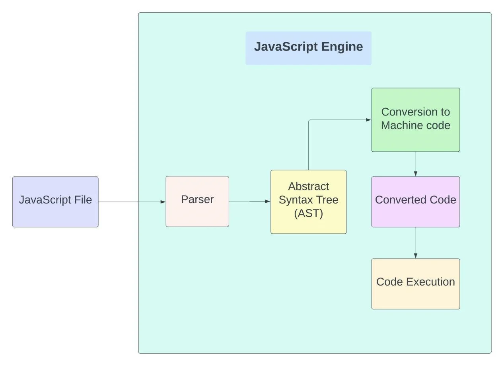

# How JavaScript Works

JavaScript is a programming language that enables web developers to create interactive and dynamic web pages. When a web page is loaded in a browser, the browser's JavaScript engine parses, compiles, and executes the JavaScript code embedded in the page. During execution, JavaScript code can manipulate the Document Object Model (DOM) of the web page, allowing for dynamic updates and interactions with the user. Additionally, JavaScript can interact with the browser's Document Object Model (DOM) and Browser Object Model (BOM) to perform tasks such as making HTTP requests and handling events.

_JavaScript is a language used to make web pages more interactive and dynamic. When you load a page, your browser reads the JavaScript code and turns it into a language it can understand. Then it runs the code to make the web page do cool things like move, update, and react to user clicks. Think of it like a puppet master controlling a puppet - JavaScript is the puppet master and the web page is the puppet. With JavaScript, you can make your web pages dance, sing, and even tell jokes!_

<p align="center">
 
</p>

## **Compilation**

Compilation phase is an important part of how JavaScript works. When a web page is loaded, the browser reads the JavaScript code and processes it through a series of steps to convert it into machine-readable code that can be executed by the computer.

- The first step in the compilation phase is **_*tokenization or lexing*_**
- The next step is **_*parsing*_**
- The final step of the compilation phase is **_*code generation*_**

### 1. Tokenization or Lexing

In this step, the JavaScript code is broken down into individual units of meaning called tokens. These tokens can be things like keywords, identifiers, operators, or punctuation. For example, consider the following line of JavaScript code:

```
var myVariable = 10;
```

During tokenization, this line of code would be broken down into the following tokens:

```
[var] [myVariable] [=] [10] [;]
```

### 2. Parsing

In this step, the tokens are converted into a tree-like structure called an **Abstract Syntax Tree (AST)**. The AST represents the syntactic structure of the code. For example, the AST for the previous line of code would look something like this:

```
Program
└── VariableDeclaration
    ├── Identifier (myVariable)
    └── NumericLiteral (10)
```

### 3. Code Generation

The final step of compilation is to convert the AST into machine-readable code, which is then executed by the computer. This step is called code generation.

<br/>

## **Execution**

Once the compiled code is executed, the browser will render the resulting changes to the webpage, which may include updating the DOM, displaying animations or pop-ups, or performing other actions.

Overall, this process of compilation and execution happens very quickly and seamlessly, allowing for dynamic and interactive web pages to be created with ease.

# Why Compilation Important

During the compilation phase, the JavaScript engine performs early error checking and determines the appropriate scope for variables in the code. This helps to ensure that the code is syntactically correct and can be executed efficiently.

For example, consider the following code:

```
function myFunction() {
  var myVariable = 10;
  console.log(myVariable);
}

myFunction();
console.log(myVariable);
```

In this code, we define a function `myFunction` that declares a variable `myVariable` and sets its value to `10`. We then call the function and log the value of `myVariable` to the console. Finally, we try to log the value of `myVariable` outside of the function.

During the compilation phase, the JavaScript engine would perform early error checking to ensure that the code is syntactically correct. It would also determine the appropriate scope for the variable `myVariable`. In this case, the variable is declared inside the function, which means it has function scope. This means that the variable can only be accessed from within the function.

Therefore, when we try to log the value of `myVariable` outside of the function, we would get an error. The JavaScript engine would have already determined during the compilation phase that `myVariable` is not defined outside of the function's scope.

So, in summary, the compilation phase is important because it helps to catch errors early and ensures that the code can be executed efficiently. It involves tasks such as tokenization, parsing, and code generation, as well as determining variable scope and performing early error checking.

---

### **Key Concepts :**

**An Abstract Syntax Tree (AST)** is a hierarchical data structure that represents the structure of a program in a way that is independent of the programming language used to write the program. It is used by compilers, interpreters, and other tools to analyze and transform source code. The AST is a more abstract and concise representation of the source code, which makes it easier to reason about and manipulate.

---

# Set Up Your Development Environment

To start developing with JavaScript, you'll need to set up your development environment. This involves installing a text editor or an integrated development environment (IDE) and a web browser.
Although we also need a webserver to run a web application, but we will use a single HTML web page to run our JavaScript code. So, no need to install it for now.

- **Install a text editor**: A text editor is a software application that allows you to write and edit plain text files. There are many text editors available, but I personally prefer using **Visual Studio Code**.

- **Install a web browser**: A web browser is a software application that allows you to view web pages. There are many web browsers available, and some popular ones for JavaScript development include **Google Chrome**, **Mozilla Firefox**, and **Microsoft Edge**.

- **Install a Live Server Extension**: To install Live Server in Visual Studio Code, open the Extensions tab on the left-hand side, search for "Live Server," and click the Install button. Once installed, you can launch the server by opening an HTML file and clicking on the "Go Live" button in the bottom right corner of the window.

Once you have installed the necessary tools and set up your development environment, you can start writing JavaScript code. To run your JavaScript code, you can either embed it directly in an HTML file and open it in a web browser, or you can use a tool like Node.js to run it on the command line. If you are using Visual Studio Code with the Live Server extension, you can also run your JavaScript code directly in the browser with live reloading.

## Alternative Options

_If you don't want to set up a development environment on your local machine, there are several online options available. One popular option is **CodeSandbox**, which provides a web-based integrated development environment (IDE) for JavaScript development_.

---
